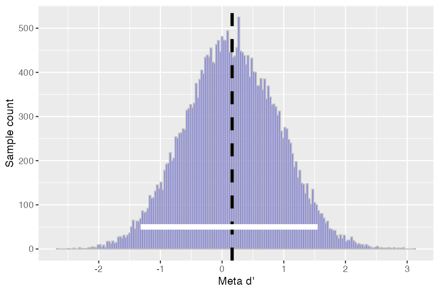

# **Heart Rate Discrimination (HRD) & Metacognitive Sensitivity Estimation (meta-d')**

This document describes an **R pipeline** for analyzing **Heart Rate Discrimination (HRD) task data** and estimating **metacognitive sensitivity (meta-d')**. This approach allows researchers to assess **how accurately individuals judge their own performance** on an interoceptive discrimination task.

## **How to Use This Package**
This package provides three main functions:
1. **`process_hrd_data(hrd_data, confbins)`** – Prepares HRD data by binning confidence ratings and removing missing values.
2. **`analyze_hrd_data(hrd_data, nRatings, plot_results, show_traceplot, participant_id)`** – Computes metacognitive sensitivity and generates summary statistics.
3. **`analyze_study(data_dir, nRatings, output_file)`** – Processes multiple HRD log files, runs `analyze_hrd_data()` on each, and creates a **group results** dataset.

### **Setting Confidence Bins (`nRatings`)**
The `nRatings` parameter determines the number of bins for **confidence ratings**. More bins provide **higher resolution** but require **more trials** to stabilize estimates. Recommended settings:
- `nRatings = 2`: Low confidence vs. high confidence.
- `nRatings = 4`: Standard for metacognitive analysis.
- `nRatings = 6+`: Only if large trial numbers are available.

### **Installation Requirements**
To run the metacognitive model, you need to install **JAGS** and the `rjags` package:
- Install **JAGS**: [Download Here](https://sourceforge.net/projects/mcmc-jags/)
- Install `rjags` in R:
  ```r
  install.packages("rjags")
  ```

---

## **Heart Rate Discrimination Task (HRD)**
The HRD task is used to assess **interoceptive accuracy**—the ability to perceive one’s own heartbeat. Participants judge whether presented auditory tones match their own heartbeats. This method provides a **psychophysical estimate** of interoceptive sensitivity and precision, and also collects confidence ratings which can be used to estimate metacognitive parameters.

For more details, see:
> **Legrand, N., et al. (2022).**  The heart rate discrimination task: A psychophysical method to estimate the accuracy and precision of interoceptive beliefs. *Biological Psychology, 168*, 108239.  
> **[DOI: 10.1016/j.biopsycho.2021.108239](https://www.sciencedirect.com/science/article/pii/S0301051121002325)**【65†source】

## **Metacognitive Efficiency Estimation (meta-d')**
To evaluate metacognitive ability in HRD, we estimate **meta-d’**, a measure of how well confidence ratings reflect actual task performance. This is adapted in **R** from **Steve Fleming’s hierarchical Bayesian framework**.

For more details, see:
> **Fleming, S. M. (2017).** HMeta-d: Hierarchical Bayesian Estimation of Metacognitive Efficiency from Confidence Ratings. *Neuroscience of Consciousness.*  
> **[DOI: 10.1093/nc/nix007](https://doi.org/10.1093/nc/nix007)**【66†source】.

For a broader review of metacognition measurement, see:
> **Fleming, S. M., & Lau, H. C. (2014).** How to measure metacognition. *Frontiers in Human Neuroscience, 8*, 443.  
> **[DOI: 10.3389/fnhum.2014.00443](https://doi.org/10.3389/fnhum.2014.00443)**【64†source】.

---

# **1. `analyze_hrd_data()`**
## **Function Overview**
This function:
- **Processes HRD task data**
- **Fits a metacognitive model** using Bayesian estimation
- **Computes key metrics**: meta-d', AUROC, decision threshold, slope, confidence, and accuracy
- **Saves plots** for visualization

### **Function Signature**
```r
analyze_hrd_data(hrd_data, nRatings = 4, plot_results = TRUE, show_traceplot = TRUE, participant_id = "unknown")
```

### **Input Arguments**
| Argument          | Type    | Description |
|------------------|--------|-------------|
| `hrd_data`       | DataFrame | HRD dataset for one subject |
| `nRatings`       | Integer | Number of confidence rating bins |
| `plot_results`   | Boolean | Whether to display and save plots |
| `show_traceplot` | Boolean | Whether to generate a traceplot |
| `participant_id` | String  | Subject identifier for saving figures |

### **Returns**
A **data frame** containing:
- **`estimated_threshold`**: Decision threshold from last trial
- **`estimated_slope`**: Estimated decision slope
- **`mean_accuracy`**: Average accuracy across trials
- **`mean_confidence`**: Average confidence rating
- **`auroc`**: Area Under the ROC Curve (discrimination measure)
- **`d`**: Discrimination index (d')
- **`metad`**: Meta-d' (metacognitive sensitivity)
- **`mratio`**: Meta-d' / d' ratio (metacognitive efficiency)

---

## **Example Usage**
```r
# Load HRD data
hrd_data <- read_delim("data/SS9909HRD_final.txt", delim = ",")

# Analyze subject data
results <- analyze_hrd_data(hrd_data, nRatings = 4, plot_results = TRUE, show_traceplot = TRUE, participant_id = "SS9909")

# View results
print(results)
```

---

## **Example Figures**
These figures help **assess data quality**:

### **Confidence Histogram + Trial Alpha**
- **What it shows**: Distribution of confidence ratings and variability across trials.
- **How to use it**: A well-calibrated dataset should show **higher confidence on correct trials**.


### **Posterior Meta-d’ Distribution**
- **What it shows**: The estimated posterior distribution of **meta-d’**, showing uncertainty.
- **How to use it**: If the distribution is too wide or centered near zero, the model may have insufficient data.



---
